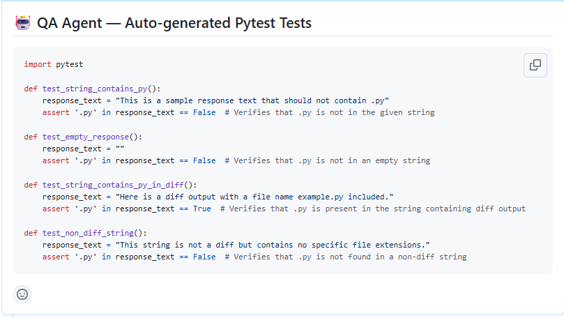
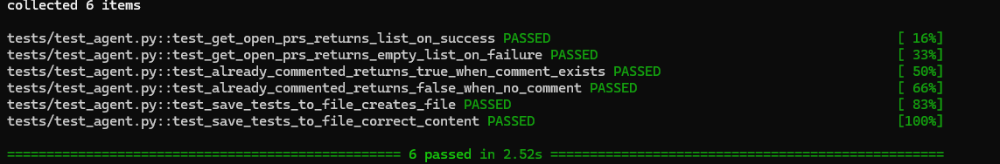

# QA Agent 🤖

An agentic Python tool that watches GitHub repositories for new pull requests,
reads the code diff, and automatically generates Pytest test cases using an LLM.
Generated tests are posted directly as a comment on the PR — before a human reviewer
even opens it.

## Why this exists

In high-velocity engineering teams and regulated industries, every code change needs
test coverage. Manual test writing is slow and inconsistent. This agent automates the
first layer of QA — generating a test scaffold automatically on every new PR.

Inspired by how companies like GitHub and Google trigger automated checks on every
pull request before human review begins.

## How it works

1. Connects to the GitHub API and fetches all open pull requests
2. Skips PRs it has already commented on — no duplicates
3. Skips diffs with no Python files — no wasted LLM calls
4. Truncates diffs over 10,000 characters — controls cost and context limits
5. Sends the diff to GPT-4o-mini with a QA engineering prompt
6. Strips preamble and markdown from LLM output — runnable tests only
7. Saves generated tests to generated_tests/test_pr_N.py
8. Posts tests as a formatted comment on the PR

## Tests passing

## Tested against real repos

Pointed at `microsoft/vscode` — one of the most active open source repositories
in the world. The agent processed live PRs and posted comments that were seen
and reacted to by Microsoft engineers.

## Field testing

Run against `microsoft/vscode` with 10+ PRs processed in a single session.

- Comments posted on live PRs, seen and reacted to by Microsoft engineers
- Most TypeScript PRs correctly filtered out — Python-only processing working
- Large diffs truncated at 10,000 characters — affects test depth on big PRs
- Best results on small, focused diffs with clear logic changes

Honest assessment: outputs range from genuinely useful to generic depending
on diff clarity. Ongoing improvement focus is prompt quality and diff filtering.

## Tech stack

- Python 3.12
- GitHub REST API
- OpenAI API (gpt-4o-mini)
- Pytest + unittest.mock
- python-dotenv

## Setup

1. Clone the repo
2. Create a virtual environment: `uv venv && source .venv/bin/activate`
3. Install dependencies: `uv add requests pytest python-dotenv openai`
4. Copy `.env.example` to `.env` and add your tokens
5. Update `config.py` with your target repo
6. Run: `python main.py`

## Project structure

- `agent.py` — All GitHub and LLM functions
- `main.py` — Pipeline orchestration  
- `config.py` — Centralised settings
- `tests/test_agent.py` — Unit tests with mocking
- `assets/` — Screenshots for README
- `.env.example` — Token template
- `DEVLOG.md` — Weekly build log
​